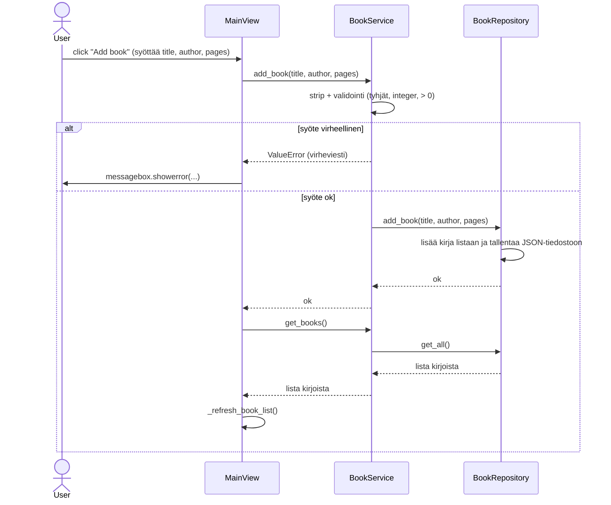

# Arkkitehtuurikuvaus

## Rakenne

Sovelluksen rakenne noudattaa kolmitasoista kerrosarkkitehtuuria:
- UI - graafinen käyttöliittymä (Tkintern näkymät)
- Services - sovelluslogiikka (käyttäjät ja kirjat)
- Repositories - tietojen pysyväistallennus JSON-tiedostoihin
- Data - sisältää apufunktioita tiedstokäsittelyyn

Käyttöliittymä kerros kutsuu services-kerroksen luokkia ja services käyttää repositories-kerrosta tallennusta varten.


## Käyttöliittymä

Koostuu kolmesta näkymästä:
- Login - kirjautuminen olemassa olevalla käyttäjätunnuksella
- Register - uuden käyttäjätunnuksen luominen
- Main - kirjautuneen käyttäjän kirjalista

UI-luokka vastaa näkymien näyttämisestä ja vaihtamisesta. Jokainen näkumä on oma Tkinkter-luokka. Ne eivät tee tiedostokäsittelyä, vaan kutsuvat palveluluokkia.

Main-näkymä:
- Näyttää lomakkeen uuden kirjan lisäämistä varten
- Jakaa kirjat kahteen listaan: "Unread books" ja "Read books"
- Kaksoisklikkauksella voi merkitä kirjan luetuksi tai päinvastoin
- Sisältää hakukentän, joka suodatta kirjat kirjan nimen tai kirjailijan perusteella
- Näyttää tilastot luetuista sivuista sivumääränä tai prosentteina
- Mahdollistaa nähdä luetut sivut matplotlib-pylväsdiagrammina


# Sovelluslogiikka

Sovelluslogiikasta vastaavat luokat UserService ja BookService. Ne tarjoavat käyttöliittymälle rajapinnan sovelluksen toiminnallisuuksiin:

```mermaid
classDiagram
    class UserService{
        _file_path
        _users
        create_user(username, password)
        login(username, password)
        authenticate(username, password)
    }

    class BookService{
        add_book(title, author, pages_str)
        get_books()
        delete_book(index)
        toggle_book_read(index)
    }

    class BookRepository{
        _file_path
        _books
        add_book(...)
        delete_by_index(index)
        toggle_read_status(index)
        get_all()
    }

    UserService --> "JSON file" 
    BookService --> BookRepository
```

- UserService huolehtii käyttäjän luomisesta, tallentamisesta ja kirjautumisesta
- BookService huolehtii kirjojen lisäämisestä, poistamisesta, luettu-tilan vaihtamisesta, sekä tilastojen laskemisesta
- BookServise ei tallenna mitään, vaan käyttää BookRepository luokkaa kirjalistan tallennuksen


## Tietojen pysyväistallennus

BookRepository luokka vastaa tietojen pysyväistallennuksesta ja UserServise tiedostokäsittelystä.
- Käyttäjät tallennetaan JSON-tiedostoon
- Jokaisella käyttäjällä on oma kirjatiedostonsa
- Lataa kirjat listaan sovelluksen käynnistyessä
- Tallentaa kirjat JSON-tiedostoon aina, kun kirjoja lisätään, poistetaan tai luettu-tila muuttuu
- Käyttöliittymä ei käsittele tiedostoa suoraan, vaan pyytää dataa BookServicen kautta 


# Sekvenssikaavio - Kirjan lisääminen
Kirjan lisääminen sekvenssikaaviona:



Muut toiminnot, kuten kirjna poistaminen, luettu-tilan vaihtaminen tai haku noudattavat samaa kaavaa. Eli käyttöliittymä kutsuu BookService-metodia, BookService päivittää tilan repositoryn avulla ja käyttöliittymä päivittää näkymän.


## Ulkoinen kirjasto

Sovellus käyttää ulkoista kirjastoa matplotlib:
- Kirjastoa käytetään pelkästään käyttöliittymässä
- Data lasketaan BookService.get_statistics-metodin avulla (luetut / lukemattomat sivut)
- Käyttöliittymä piirtää tuloksista pylväsdiagrammin


## Sovelluksen heikkoudet

- Sovellus tallentaa tiedot JSON-tiedostoihin. Sovelluksen laajentuessa tai kirjamäärn kasvaessa se ei ole enää optimaalisin tapa tallentaa tietoa.


