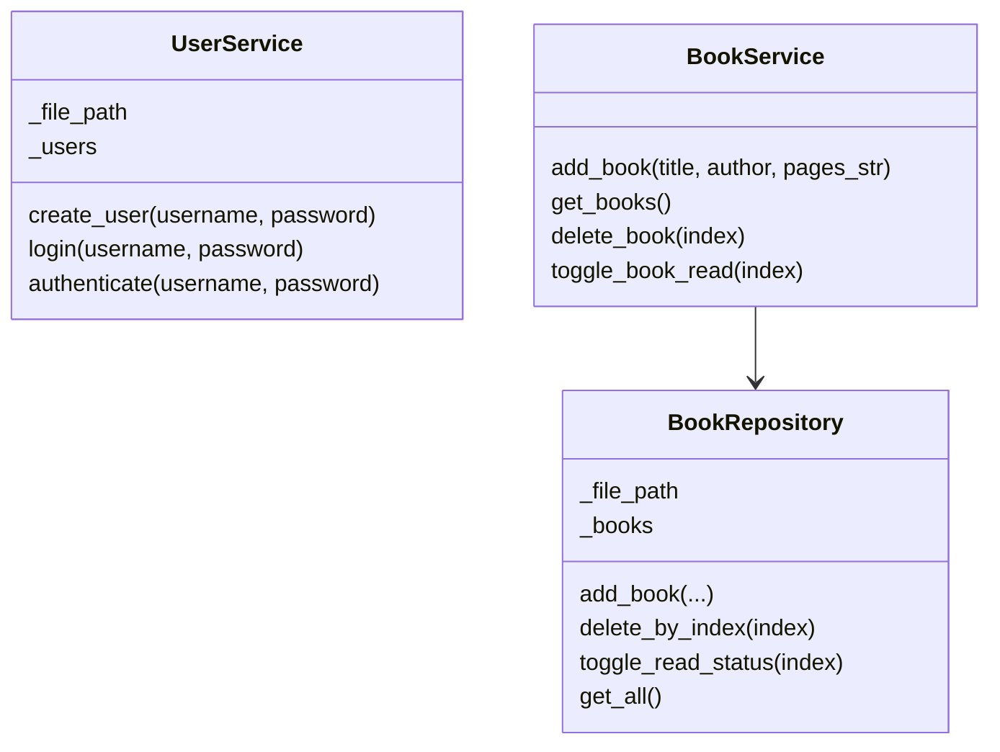
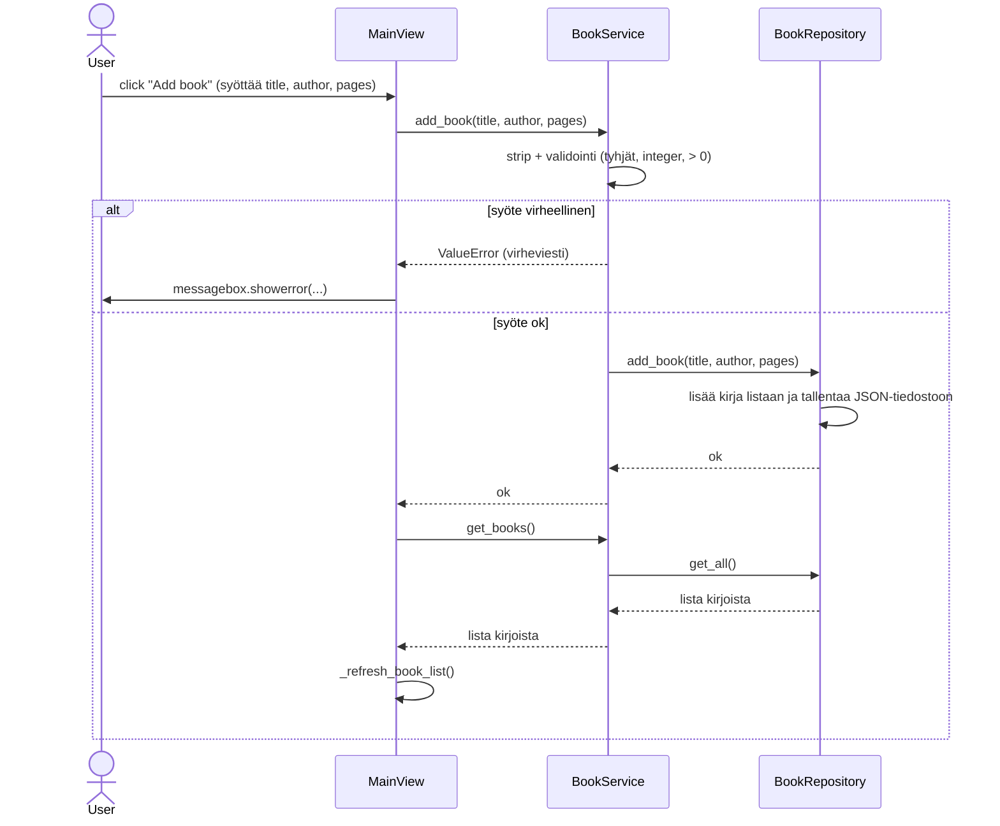

# Sovelluslogiikka

Sovelluksessa on kolmitasoinen kerrosarkkitehtuuri:
- UI-kerros näyttää Tkninter käyttöliittymän
- Sevices-kerros sisältää käyttäjiin ja kirjoihin liittyvän sovelluslogiikan
- Repositories-kerros tallentaa kirjat JSON-tiedostoihin

Käyttöliittymä kutsuu vain service-luokkia ja service-luokat hoitavat tiedostonkäsittelyn repository-luokkien kautta.

# Sekvenssikaavio
Kirjan lisääminen:

