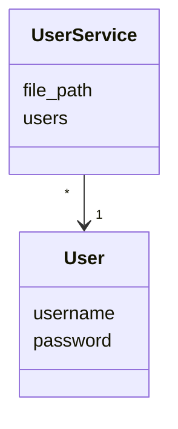
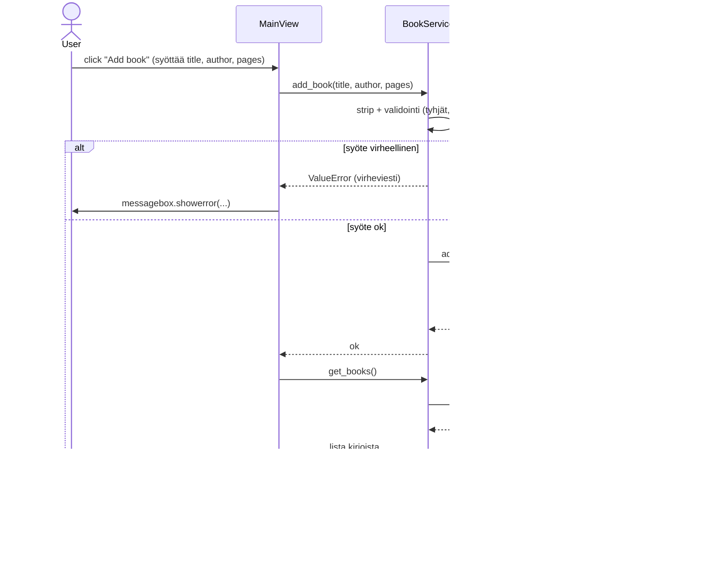

# Sovelluslogiikka

Sovelluksen alustava logiikka --> tarkentuu toiminnallisuuden lisääntyessä

```mermaid
 classDiagram
      UserService "*" --> "1" User
      class User{
          username
          password
      }
      class UserService{
          file_path
          users
      }
```

# Sekvenssikaavio
Kirjan lisääminen:

```mermaid
sequenceDiagram
    actor User
    participant MV as MainView
    participant BS as BookService
    participant BR as BookRepository

    User->>MV: click "Add book" (syöttää title, author, pages)
    MV->>BS: add_book(title, author, pages)

    BS->>BS: strip + validointi (tyhjät, integer, > 0)

    alt syöte virheellinen
        BS-->>MV: ValueError (virheviesti)
        MV->>User: messagebox.showerror(...)
    else syöte ok
        BS->>BR: add_book(title, author, pages)
        BR->>BR: lisää kirja listaan ja tallentaa JSON-tiedostoon
        BR-->>BS: ok
        BS-->>MV: ok

        MV->>BS: get_books()
        BS->>BR: get_all()
        BR-->>BS: lista kirjoista
        BS-->>MV: lista kirjoista
        MV->>MV: _refresh_book_list()
    end
```

